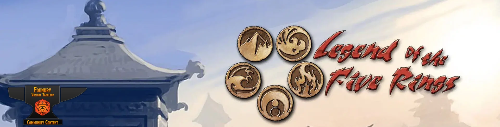

# Unofficial L5R 4th Edition System for Foundry VTT 

Unofficial implementation of the Legend of the Five Rings 4th edition for Foundry VTT. Provides character sheets for pcs and npcs.

### Features

- Trait rolls, ring rolls, spellcasting rolls, skill rolls and damage rolls from the character sheet.
- Enforces the "Ten dice rule" for rolls from the character sheet.
- Automatically calculates derived attributes such as initiative, Armor TN and rings.
- Automatically calculates the current would level based on the wounds suffered.
- A simplified sheet for npcs with rollable attacks, skills and damage.
- Use ctrl+click on rings to autmatically generate unskilled rolls (unseful for unskilled void rolls).

#### Dice Roller

Captures chat message and converts to a Foundry VTT roll pattern and shows the result with the Legend of Five Rings text roll.

- It makes roll with different explosion numbers;
- Accepts Unskilled rolls;
- Accepts Emphases rolls;

Syntax Allowed: XkYxZ+A or uXkY+A or eXkYxZ+A

- u = unskilled roll (no explosion);
- e = emphasis roll (reroll the 1 of the first roll);
- X = Number of rolled dice;
- Y = Number of kept dice;
- Z = Number equal or higher to explode;
- A = Bonus applied.

Example:

- 10k6 is converted to '/r 10d10k6x>=10'
- 10k8x9 is converted to '/r 10d10k8x>=9'
- u10k7 is converted to '/r 10d10k7'
- e10k5x8 is converted to '/r 10d10r1k5x>=8

##### Accepts FVTT Rolls

It can be used with roll, GM roll, self roll, blind roll and deferred inline roll.

Example:

- /r or /roll 6k5;
- /gmr or /gmroll 6k5;
- /sr or /selfroll 6k5;
- /br or /broll or /blindroll 6k5;
- Message [[/r 6k5]] works well;
- Message [[6k5]] works well;

## Available languages

- English
- Español
- Français
- Português (Brasil) 

## Installation

The recommended installation method is with the usual FoundryVTT installer (see the foundry [tutorial](https://foundryvtt.com/article/tutorial/)). This system is listed as https://foundryvtt.com/packages/l5r4.

Manifest: https://gitlab.com/team-l5r4/l5r4/-/raw/master/system.json

Alternatively you can download this repo into your foundry data: `your_foundry_data_path/systems/`

## Recomended modules

Compatible with Dice So Nice!
https://gitlab.com/riccisi/foundryvtt-dice-so-nice

## Special thanks to contributors

- Sylvain «Greewi» Dumazet
- Roberto Lorite
- yardz
- Teddy
- [eupolemo](https://github.com/eupolemo)
- [NekohimeMusou](https://gitlab.com/NekohimeMusou)
- Junior 
- WilliamM

## License

All icons and images are property of their respective owners.

[Samurai icons created by Freepik, shmai, photo3idea_studio, juicy_fish, Flaticon, Handicon, berkahicon, cube29](https://www.flaticon.com/free-icons/samurai "samurai icons yakuza")

[Samurai icons by Hey Rabbit from Noun Project (CC BY 3.0)](https://thenounproject.com/browse/icons/term/samurai/)

This work is licensed under a GNU General Public License v3.0 and [Foundry Virtual Tabletop EULA - Limited License Agreement for module development.](https://foundryvtt.com/article/license/)

